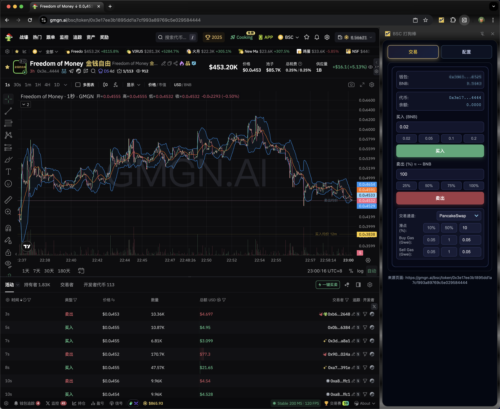
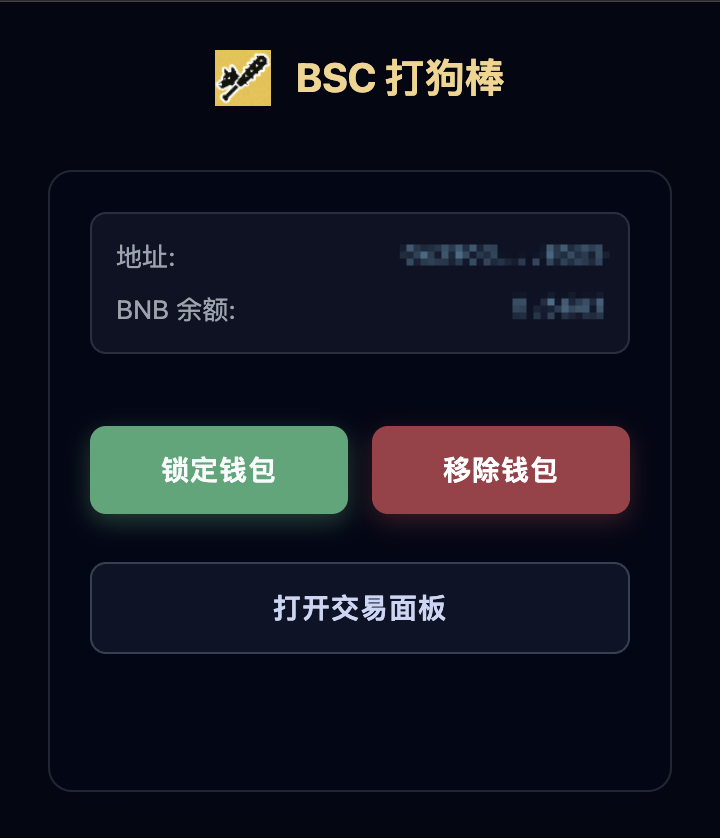
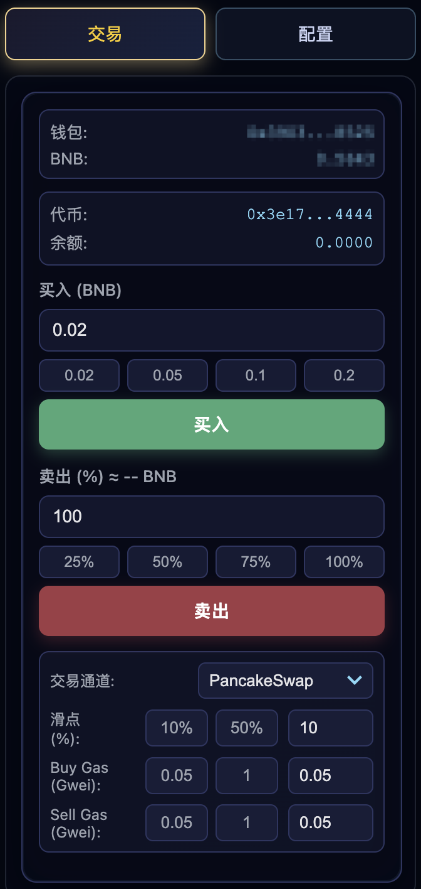
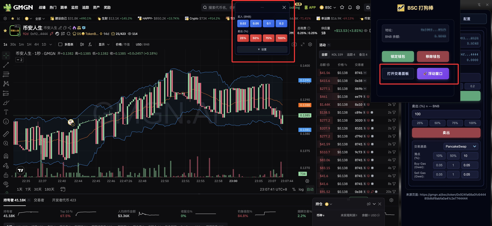

# BSC 打狗棒 (BSC Dog Bang)

<div align="center">


一款专业的 Binance Smart Chain (BSC) Meme 代币交易 Chrome 插件

[功能特性](#功能特性) •
[快速开始](#快速开始) •
[文档](#文档) •
[贡献指南](#贡献指南) •
[许可证](#许可证)

</div>

---

## 简介

BSC 打狗棒是一款专为 BSC 链上 Meme 代币交易设计的 Chrome 浏览器插件。它允许用户直接与 Four.meme、Flap.sh、Luna.fun、PancakeSwap 等 DEX 合约进行交互，实现快速、安全的代币买卖操作。

## 界面预览

<div align="center">

### 侧边栏交易面板



*在浏览器侧边栏中直接交易，不遮挡页面内容*

### 核心界面

<table>
  <tr>
    <td align="center">
      <br/>
      <b>钱包管理</b>
    </td>
    <td align="center">
      <br/>
      <b>交易侧边栏</b>
    </td>
    <td align="center">
      <br/>
      <b>浮动交易窗口</b>
    </td>
  </tr>
</table>

*支持侧边栏和浮动窗口两种交易方式，满足不同使用习惯*

</div>

## 功能特性

### 🎯 多交易界面
- **侧边栏面板**: 在浏览器侧边栏打开完整交易界面，不遮挡页面内容
- **浮动交易窗口**: 极简高效的浮动窗口，支持拖拽、自动恢复位置，随时随地快速交易
- **智能切换**: 根据使用场景自由选择交易方式

### 💼 核心功能
- **多平台支持**: 支持 Four.meme、Flap.sh、Luna.fun、PancakeSwap 等主流 Meme 代币发射平台
- **安全钱包管理**: 本地加密存储私钥，密码保护解锁机制
- **一键交易**: 在浏览代币页面时，直接通过插件快速买卖
- **实时行情**: 集成价格查询和余额显示
- **交易监控**: WebSocket + HTTP 双重交易状态监听
- **Gas 优化**: 智能 Gas 估算，支持自定义 Gas 设置
- **滑点保护**: 可配置滑点容差，避免交易失败
- **交易历史**: 完整的交易记录追踪

## 技术栈

- **前端框架**: React 19 + TypeScript
- **构建工具**: Vite 7
- **区块链**: viem (以太坊交互库)
- **样式**: CSS
- **Chrome Extension API**: Manifest V3

## 快速开始

### 安装方式 1: 从 Release 下载（推荐）

1. 前往 [Releases](https://github.com/0xyaofan/bsc-dog-bang-plugin/releases) 页面
2. 下载最新版本的 `bsc-dog-bang-plugin-v{version}.zip`
3. 解压缩到本地目录
4. 打开 Chrome 浏览器，进入 `chrome://extensions/`
5. 开启右上角的"开发者模式"
6. 点击"加载已解压的扩展程序"，选择解压后的 `extension` 目录
7. 插件安装完成！

### 安装方式 2: 从源码构建

详见 [部署手册](docs/deployment.md)

## 使用指南

### 初次使用

1. 点击浏览器工具栏的插件图标
2. 导入您的 BSC 钱包私钥（私钥仅在本地加密存储）
3. 设置密码保护
4. 开始交易！

### 交易流程

1. 访问支持的代币页面（如 `https://four.meme/token/xxx`）
2. 页面会自动注入交易按钮
3. 点击"买入"或"卖出"按钮
4. 设置交易金额和参数
5. 确认交易
6. 等待区块链确认

详细使用说明请参考 [使用手册](docs/user-guide.md)

## 文档

- [功能说明](docs/features.md) - 详细功能介绍
- [浮动窗口使用指南](FLOATING_WINDOW.md) - 浮动交易窗口完整文档
- [环境配置](docs/setup.md) - 开发环境配置指南
- [开发手册](docs/development.md) - 开发指南和架构说明
- [部署手册](docs/deployment.md) - 构建和部署指南
- [使用手册](docs/user-guide.md) - 用户使用指南
- [API 文档](doc/Four-MEME-API-Documents.30-10-2025.md) - Four.meme API 文档

## 项目结构

```
bsc-dog-bang-plugin/
├── src/
│   ├── background/        # Service Worker 后台脚本
│   ├── content/           # 内容脚本（页面注入）
│   ├── popup/             # 插件弹窗界面
│   ├── sidepanel/         # 侧边栏交易面板
│   ├── offscreen/         # 离屏文档（加密操作）
│   └── shared/            # 共享模块和配置
├── extension/             # 插件静态资源
│   ├── manifest.json      # 插件清单文件
│   ├── icons/             # 图标资源
│   └── dist/              # 构建输出目录
├── abis/                  # 智能合约 ABI 文件
├── docs/                  # 文档
└── scripts/               # 构建脚本
```

## 安全提示

- **私钥安全**: 私钥仅在本地浏览器存储中加密保存，永不上传到任何服务器
- **密码保护**: 使用强密码保护您的钱包
- **定期备份**: 请务必备份您的私钥
- **谨慎交易**: 代币交易存在风险，请谨慎操作
- **验证合约**: 交易前请确认合约地址正确

## 支持的网站

- [gmgn.ai](https://gmgn.ai) - BSC 代币数据平台
- [four.meme](https://four.meme) - Meme 代币发射平台
- [flap.sh](https://flap.sh) - Meme 代币交易平台
- [web3.binance.com](https://web3.binance.com) - Binance Web3 钱包

## 贡献指南

我们欢迎所有形式的贡献！请查看 [贡献指南](CONTRIBUTING.md) 了解如何参与项目。

## 开发路线图

- [x] 基础钱包功能
- [x] Four.meme 交易支持
- [x] Flap.sh 交易支持
- [x] PancakeSwap 交易支持
- [x] 交易历史记录
- [ ] Luna.fun 交易支持
- [ ] 多钱包管理
- [ ] 交易机器人功能
- [ ] Chrome Web Store 发布

## 常见问题

**Q: 插件是否安全？**
A: 是的，所有私钥仅在本地加密存储，代码完全开源可审计。

**Q: 支持哪些浏览器？**
A: 目前仅支持 Chrome 和基于 Chromium 的浏览器（如 Edge、Brave）。

**Q: 交易失败怎么办？**
A: 请检查 Gas 设置、滑点设置和钱包余额。详见 [使用手册](docs/user-guide.md#troubleshooting)。

**Q: 如何更新插件？**
A: 从 [Releases](https://github.com/0xyaofan/bsc-dog-bang-plugin/releases) 下载最新版本并重新加载。

## 许可证

本项目采用 [MIT License](LICENSE) 开源协议。

## 免责声明

本软件仅供学习和研究使用。使用本软件进行交易的所有风险由用户自行承担。开发者不对任何直接或间接的损失负责。

加密货币交易存在极高风险，请务必：
- 只投资您能承受损失的金额
- 进行充分的研究和尽职调查
- 了解相关法律法规
- 谨慎对待高风险 Meme 代币

## 联系方式

- **Issues**: [GitHub Issues](https://github.com/0xyaofan/bsc-dog-bang-plugin/issues)
- **作者**: 0xyaofan

---

<div align="center">

**如果这个项目对您有帮助，请给我们一个 ⭐️ Star！**

Made with ❤️ for BSC Meme Community

</div>
