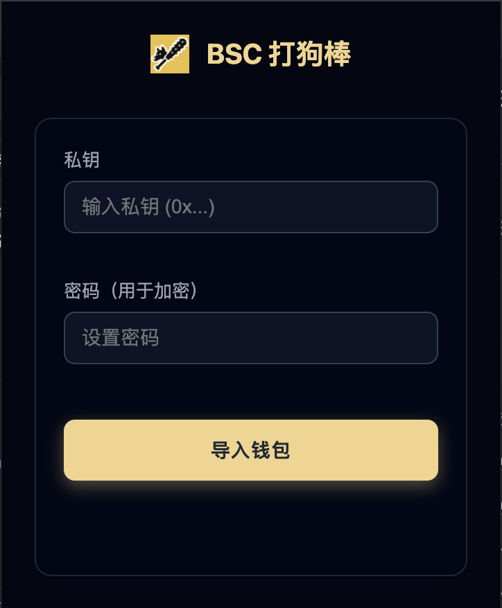
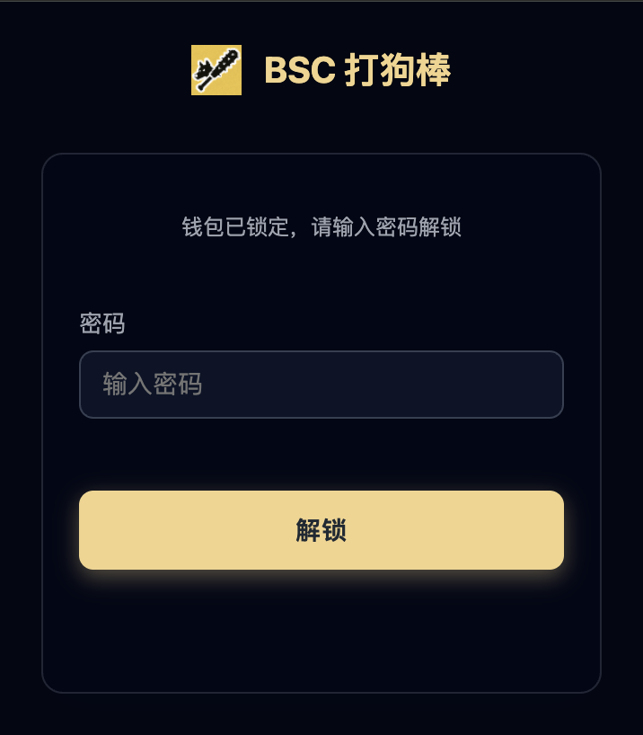
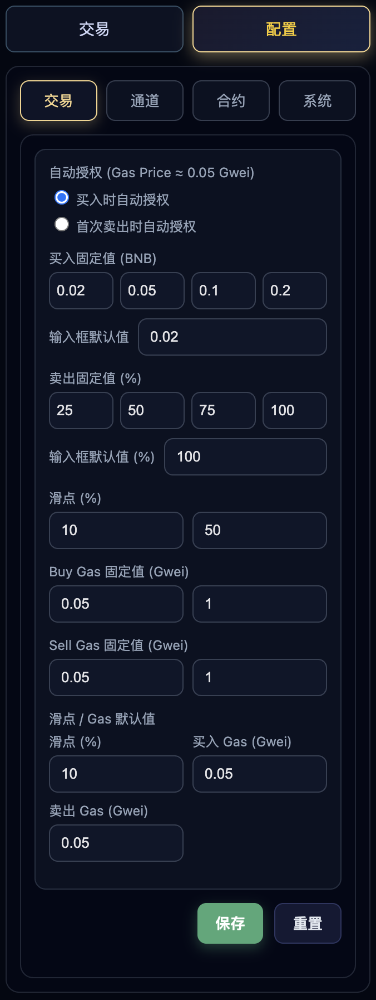
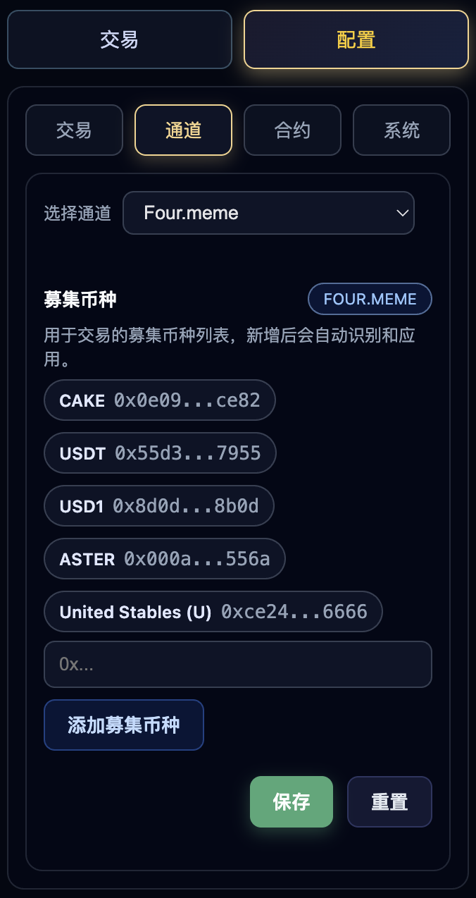
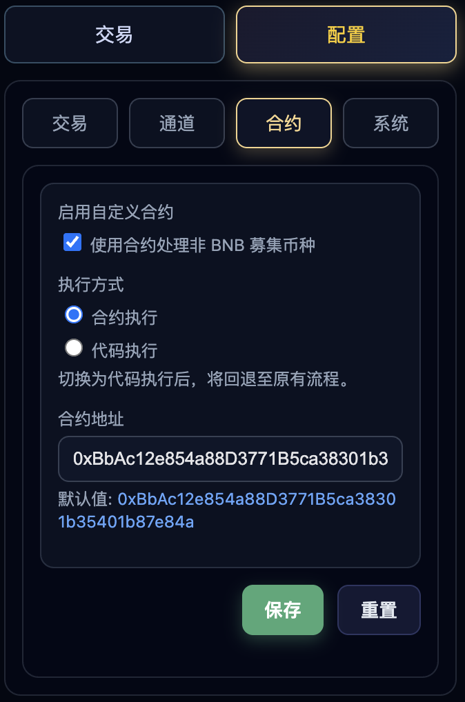
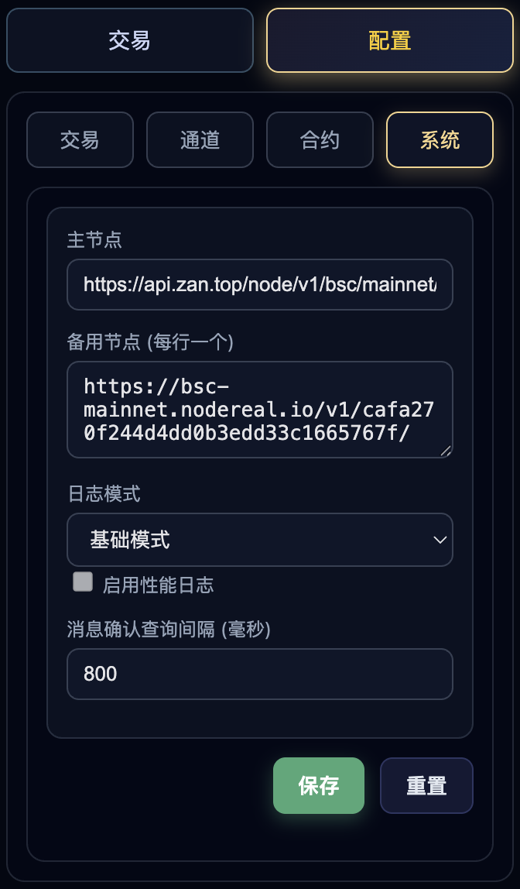

# 使用手册

欢迎使用 BSC 打狗棒！本手册将指导您完成插件的安装、配置和使用。

## 目录

- [安装插件](#安装插件)
- [首次配置](#首次配置)
- [基本操作](#基本操作)
- [交易指南](#交易指南)
- [安全建议](#安全建议)
- [常见问题](#常见问题)
- [故障排除](#故障排除)

## 安装插件

### 从 GitHub Releases 安装（推荐）

1. **下载插件包**
   - 访问 [Releases](https://github.com/0xyaofan/bsc-dog-bang-plugin/releases) 页面
   - 下载最新版本的 `bsc-dog-bang-plugin-v{version}.zip`
   - 解压到本地目录（记住这个位置）

2. **加载到 Chrome**
   - 打开 Chrome 浏览器
   - 访问 `chrome://extensions/`
   - 开启右上角的"开发者模式"开关
   - 点击"加载已解压的扩展程序"
   - 选择解压后的 `extension` 目录
   - 看到插件图标表示安装成功

3. **固定插件图标**（可选）
   - 点击浏览器工具栏右侧的拼图图标
   - 找到"BSC 打狗棒"
   - 点击图钉图标固定到工具栏

### 从源码安装

详见 [部署手册](deployment.md)

## 首次配置

### 1. 导入钱包

首次使用需要导入您的 BSC 钱包：

1. **点击插件图标**
   - 工具栏会显示弹出窗口

2. **准备私钥**
   - 确保您的私钥格式为: `0x` + 64位十六进制字符
   - 示例: `0x1234567890abcdef...`
   - ⚠️ **仅使用测试钱包或您能承受损失的钱包**

3. **导入步骤**
   - 在"私钥"框中粘贴私钥
   - 在"密码"框中设置加密密码（至少 8 位）
   - 点击"导入钱包"
   - 等待导入完成

<div align="center">


*导入钱包界面*
</div>

4. **验证导入**
   - 导入成功后会显示钱包地址
   - 显示 BNB 余额
   - 状态变为"已解锁"

<div align="center">


*钱包信息界面*
</div>

### 2. 了解界面

#### Popup 界面

点击插件图标打开：

```
┌──────────────────────────┐
│  BSC 打狗棒              │
├──────────────────────────┤
│  地址: 0x1234...5678     │
│  BNB 余额: 0.5 BNB       │
├──────────────────────────┤
│  [锁定钱包] [移除钱包]   │
│  [打开交易面板]          │
└──────────────────────────┘
```

**功能说明**:
- **锁定钱包**: 保护钱包，需要密码重新解锁
- **移除钱包**: 删除所有钱包数据（⚠️ 请先备份私钥）
- **打开交易面板**: 打开侧边栏交易界面

#### 侧边栏交易面板

Chrome 114+ 支持，更好的交易体验：

<div align="center">


*侧边栏在浏览器中的展示效果*
</div>

<div align="center">


*侧边栏交易界面*
</div>

## 基本操作

### 锁定和解锁钱包

#### 锁定钱包

**何时需要锁定**:
- 暂时离开电脑
- 完成交易后
- 提高安全性

**操作步骤**:
1. 点击插件图标
2. 点击"锁定钱包"按钮
3. 钱包立即锁定

#### 解锁钱包

**操作步骤**:
1. 点击插件图标
2. 输入导入时设置的密码
3. 点击"解锁"按钮
4. 解锁成功后可进行交易

<div align="center">


*钱包锁定状态，需要输入密码解锁*
</div>

### 查看余额

**BNB 余额**:
- 在 Popup 界面自动显示
- 每次打开时更新

**代币余额**:
- 在对应代币页面显示
- 点击刷新按钮更新

### 移除钱包

⚠️ **危险操作！请先备份私钥！**

**操作步骤**:
1. 点击插件图标
2. 点击"移除钱包"按钮
3. 确认提示对话框
4. 所有数据被清除

## 交易指南

### 在 Four.meme 交易

#### 买入代币

1. **访问代币页面**
   - 打开 `https://four.meme/token/{address}`
   - 页面会自动注入交易界面

2. **设置买入参数**
   - **BNB 数量**: 输入要花费的 BNB 数量
   - **快捷按钮**: 点击 25%/50%/75%/100% 快速填充
   - **滑点**: 默认 10%，可调整

3. **执行买入**
   ```
   输入金额: 0.1 BNB
   ↓
   点击"买入"
   ↓
   确认交易信息
   ↓
   等待交易确认（3-5秒）
   ↓
   交易成功！
   ```

4. **查看结果**
   - 收到浏览器通知
   - 余额自动更新
   - 查看交易哈希

#### 卖出代币

1. **在代币页面点击"卖出"**

2. **设置卖出参数**
   - **卖出数量**: 输入代币数量
   - **百分比**: 点击 25%/50%/75%/100%
   - **预估收益**: 显示预计获得的 BNB

3. **执行卖出**
   ```
   选择数量: 100% (全部卖出)
   ↓
   点击"卖出"
   ↓
   如果是首次卖出该代币：
     需要先 Approve（授权）
     ↓
     等待授权确认
     ↓
   执行卖出交易
   ↓
   交易成功！
   ```

### 在 Flap.sh 交易

#### 买入流程

1. **访问代币页面**
   - `https://flap.sh/{slug}`

2. **使用注入的交易界面**
   - 输入 BNB 数量
   - 设置滑点
   - 点击"买入"

3. **确认交易**
   - 检查预估获得的代币数量
   - 确认交易

#### 卖出流程

1. **选择卖出**
2. **输入数量或百分比**
3. **首次需要 Approve**
4. **执行卖出交易**

### 在 gmgn.ai 查看代币

1. **访问代币页面**
   - `https://gmgn.ai/bsc/token/{address}`

2. **使用快捷交易**
   - 页面注入买卖按钮
   - 一键快速交易

### PancakeSwap 交易

**任意 BEP20 代币交换**:

1. **在支持的页面使用插件**
2. **选择交易对**
   - BNB ↔ Token
   - Token ↔ BNB
3. **执行交易**

## 高级设置

插件提供了丰富的设置选项，可以根据需求自定义配置：

<div align="center">

### 交易设置


### 通道设置


### 合约设置


### 系统设置


</div>

## 交易参数详解

### Gas 设置

**Gas Price（Gas 价格）**:
- 默认: 3 Gwei
- 建议范围: 3-5 Gwei
- 越高越快，但成本越高

**Gas Limit（Gas 限制）**:
- 买入: 300,000
- 卖出: 350,000
- 一般无需修改

**如何设置 Gas**:
```
高优先级（快速）: 5 Gwei
中优先级（标准）: 3 Gwei
低优先级（慢速）: 1 Gwei
```

### 滑点设置

**什么是滑点**:
- 交易执行时价格变化的容忍度
- 滑点越大，交易越容易成功，但可能价格不理想

**推荐设置**:
```
流动性好的代币: 1-5%
流动性差的代币: 10-20%
Meme 代币: 10-15%
波动剧烈: 20-30%
```

**注意**:
- 滑点过低可能导致交易失败
- 滑点过高可能导致价格损失

### 截止时间

**含义**:
- 交易必须在此时间内确认
- 超时交易自动失败

**默认**: 20 分钟
**建议**: 保持默认，除非网络拥堵

## 安全建议

### 私钥安全

✅ **应该做的**:
- 使用强密码加密
- 定期备份私钥
- 仅在可信设备使用
- 使用测试钱包

❌ **不应该做的**:
- 不要分享私钥
- 不要截图私钥
- 不要在公共网络使用
- 不要存放大额资金

### 交易安全

**验证合约地址**:
```
1. 在区块链浏览器查看合约
2. 检查合约是否开源验证
3. 查看持有人分布
4. 警惕蜜罐合约
```

**控制风险**:
- 小额测试交易
- 分批买入
- 设置止损
- 不要 FOMO（害怕错过）

### 网络安全

- 仅访问官方网站
- 检查 HTTPS 证书
- 警惕钓鱼网站
- 不要点击可疑链接

## 常见问题

### Q1: 导入钱包后看不到余额？

**原因**:
- RPC 节点连接问题
- 网络延迟

**解决**:
1. 等待几秒后刷新
2. 检查网络连接
3. 重新解锁钱包

### Q2: 交易失败怎么办？

**可能原因**:
1. Gas 太低
2. 滑点太小
3. 余额不足
4. 合约问题

**解决方案**:
```
检查 BNB 余额（需要 Gas）
↓
增加 Gas Price
↓
增加滑点
↓
重试交易
```

### Q3: 卖出时需要 Approve？

**这是正常的**:
- 首次卖出某代币需要授权
- 授权只需一次
- 授权后可多次交易

**流程**:
```
1. 点击 Approve（需要 Gas）
2. 等待确认
3. 再次点击卖出
```

### Q4: 交易确认很慢？

**原因**:
- Gas Price 太低
- 网络拥堵
- RPC 节点慢

**解决**:
- 等待确认（通常 3-30 秒）
- 下次提高 Gas Price
- 在 BSCScan 查看交易状态

### Q5: 插件刷新后需要重新解锁？

**这是安全特性**:
- 插件刷新会自动锁定钱包
- 重新输入密码解锁
- 保护资金安全

## 故障排除

### 插件无法加载

```bash
1. 检查是否开启开发者模式
2. 确认选择了正确的 extension 目录
3. 查看控制台错误信息
4. 尝试重新构建: npm run build
```

### 交易一直 Pending

```bash
1. 在 BSCScan 查看交易状态
2. 检查 Gas Price 是否过低
3. 尝试加速交易（发送相同 nonce 的交易，Gas 更高）
```

### 余额显示错误

```bash
1. 点击刷新按钮
2. 重新解锁钱包
3. 检查 RPC 节点连接
4. 在 BSCScan 确认实际余额
```

### 无法连接网络

```bash
1. 检查网络连接
2. 尝试切换 RPC 节点
3. 查看控制台网络请求
4. 禁用可能冲突的其他扩展
```

### 密码忘记了怎么办？

⚠️ **如果忘记密码**:
1. 密码无法找回
2. 需要移除钱包并重新导入
3. 确保有私钥备份
4. 重新设置新密码

## 获取帮助

### 查看日志

1. **Background 日志**:
   ```
   chrome://extensions/
   → BSC 打狗棒
   → Service Worker
   → 检查视图
   ```

2. **Content Script 日志**:
   ```
   在代币页面
   → F12 打开开发者工具
   → Console
   → 选择 Content Script context
   ```

### 提交问题

如果遇到问题：

1. **收集信息**:
   - 插件版本
   - Chrome 版本
   - 错误信息截图
   - 控制台日志

2. **提交 Issue**:
   - 访问 [GitHub Issues](https://github.com/0xyaofan/bsc-dog-bang-plugin/issues)
   - 点击 "New Issue"
   - 填写问题模板
   - 附上收集的信息

### 社区支持

- GitHub Discussions
- 项目 README
- 开发手册

## 最佳实践

### 日常使用

1. **每次交易前**:
   - 验证代币合约地址
   - 检查流动性
   - 小额测试

2. **定期操作**:
   - 备份私钥
   - 更新插件
   - 检查安全性

3. **交易策略**:
   - 分批建仓
   - 设置止盈止损
   - 不要贪婪

### 避免常见错误

❌ **不要**:
- 在未验证的代币上投入大额
- 使用过高的滑点
- 忽略 Gas 费用
- 盲目跟单

✅ **应该**:
- 做好研究
- 控制风险
- 保持冷静
- 及时止损

## 下一步

- [功能说明](features.md) - 了解更多功能
- [开发手册](development.md) - 为项目做贡献
- [CHANGELOG](../CHANGELOG.md) - 查看版本更新

---

**祝您交易顺利！Remember: DYOR (Do Your Own Research)** 🚀
